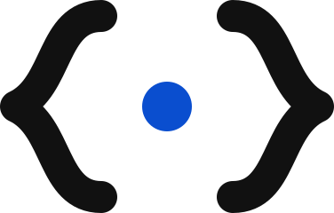

<picture>
  <source media="(prefers-color-scheme: dark)" srcset="brand/mark/mockifyr-mark-white.svg">
  
</picture>

# Mockifyr

[](https://github.com/omercelikdev/mockifyr/actions/workflows/ci.yml)
[](https://github.com/omercelikdev/mockifyr/releases)
[](https://github.com/omercelikdev/mockifyr/pkgs/container/mockifyr)
[](LICENSE)

**An independent, .NET-based API mock engine + platform.** A transport-agnostic request-matching and
response engine with first-class multi-tenancy, pluggable persistence, and thin facades — in-process
library · HTTP server · admin REST · gRPC · GraphQL · WebSocket. Clean-room codebase with its own IP
and no third-party mock-engine dependencies.

📖 **[Documentation → mockifyr.omercelik.dev](https://mockifyr.omercelik.dev)** — guides, the full CLI
and admin API reference, and [known limitations](https://mockifyr.omercelik.dev/limitations/).

## Quick start

### Docker — one image (engine + admin API + dashboard)

Just run it — in-memory, zero config, **the same one line on macOS, Linux and Windows**:

```bash
docker run -p 8080:8080 ghcr.io/omercelikdev/mockifyr
```

- Mock surface — `http://localhost:8080`
- Admin API — `http://localhost:8080/__admin`
- Dashboard — `http://localhost:8080/__mockifyr`

Create stubs in the dashboard, or import a WireMock bundle. Runs on `linux/amd64` and `linux/arm64`
(Apple Silicon included).

**Keep your data across restarts** — `docker compose up`, or a named volume (both identical on every OS):

```bash
docker compose up                                # stubs live in ./mappings, next to you
docker run -p 8080:8080 -v mockifyr-data:/work ghcr.io/omercelikdev/mockifyr   # named volume
```

Mount **`/work`**, not just `/work/mappings` — the file store also keeps environment configuration
(`/work/environments`), response body files (`/work/__files`) and gRPC descriptors (`/work/grpc`)
there, and a mappings-only mount silently loses those when the container is recreated.

**Preload / edit stub files on your host** (advanced) — bind-mount a folder of WireMock `*.json`. Only
the path syntax differs per shell; nothing else changes:

```bash
docker run -p 8080:8080 -v "$PWD/mappings:/work/mappings" ghcr.io/omercelikdev/mockifyr   # macOS / Linux
#   PowerShell:  -v "${PWD}/mappings:/work/mappings"       CMD:  -v "%cd%/mappings:/work/mappings"
```

Files load into the **default tenant**; for a named tenant (e.g. `maestro`) use the dashboard **Import**,
or POST to `/__admin/mappings/import` with an `X-Mockifyr-Tenant` header. Durable datastores:

```bash
docker compose -f docker-compose.postgres.yml up    # PostgreSQL persistence
docker compose -f docker-compose.redis.yml up       # Redis persistence
```

### .NET Aspire

Aspire recreates containers on every app-host run, so without a volume the file store — stubs *and*
environment configuration — resets each time. Mount a named volume at `/work` (and optionally keep
the container alive between runs):

```csharp
var mockifyr = builder.AddContainer("mockifyr", "ghcr.io/omercelikdev/mockifyr")
    .WithHttpEndpoint(port: 8080, targetPort: 8080)
    .WithVolume("mockifyr-data", "/work")            // survives restarts and recreation
    .WithLifetime(ContainerLifetime.Persistent);     // optional: reuse the container across runs
```

Or point it at a durable datastore instead: `.WithArgs("--postgres", connectionString)`.

### Local (.NET 10 SDK)

```bash
dotnet run --project src/Mockifyr.Server -- --port 8080 --root-dir .   # stubs load from ./mappings
```

### Engine only (no dashboard)

The dashboard is opt-in via `--dashboard`; omit it to serve just the mock surface + admin API.

```bash
# Local
dotnet run --project src/Mockifyr.Server -- --port 8080 --root-dir .   # stubs load from ./mappings

# From the image (override the entrypoint to drop the built-in --dashboard)
docker run -p 8080:8080 -v "$PWD/mappings:/work/mappings" --entrypoint dotnet \
  ghcr.io/omercelikdev/mockifyr:latest Mockifyr.Server.dll --port 8080 --root-dir /work
```

Or embed the engine directly in-process with `Mockifyr.Facade.Library` — no HTTP at all. It is not
published to NuGet yet; reference the project from a checkout of this repository.

## Configuration

Everything is a CLI flag — there is no config file. Because the host builds its configuration with the
standard .NET builder, **every flag is also readable as an environment variable of the same name**,
which is why `-e admin-user=alice` works on `docker run`; arguments win when both are present.

The common flags, with the [full reference](https://mockifyr.omercelik.dev/cli/) on the docs site:

| Flag | Effect |
|------|--------|
| `--port <n>` | mock-serving HTTP port (default 8080) |
| `--https-port <n>` | enable HTTPS / HTTP2 |
| `--root-dir <dir>` | load and persist stubs as JSON files |
| `--smtp-port <n>` | capture real SMTP mail into the tenant-scoped message inbox (`/__admin/messages`); the AUTH username names the tenant |
| `--dashboard <dir>` | serve the built dashboard under `/__mockifyr` |
| `--admin-user <u>` · `--admin-pass <p>` | require HTTP Basic auth on the admin API (`/__admin/*`); the dashboard shows a login screen |
| `--postgres <connstr>` · `--redis <connstr>` · `--litedb <path>` | durable persistence backend |
| `--change-feed` | keep multiple instances coherent |
| `--outbound-host-fallback false` | deliver callbacks and proxies to exactly the address written, never retrying via the host gateway |
| `--trust-proxy-target <host>` | trust that host's certificate on outbound calls (repeatable) |
| `--trust-all-proxy-targets` | trust every outbound certificate |

The hot path is always in-memory; a durable backend is opt-in and writes through.

### Callbacks and proxies to your own machine

Running in Docker, `localhost` inside the container means *the container* — so a callback or proxy
aimed at `http://localhost:5004` cannot reach a service on your machine, even though the same URL
works from Postman. Mockifyr handles this: a loopback target whose connection is **refused** is
retried once via `host.docker.internal` (a callback records both attempts in the journal; a proxy that
still cannot be reached answers 502 with the reason). Targeting `host.docker.internal` yourself works
too, and `--outbound-host-fallback false` turns the retry off (`--webhook-host-fallback` is a kept alias).
On Linux, `host.docker.internal` only exists if the container is started with
`--add-host=host.docker.internal:host-gateway`.

### Callbacks and proxies to an internal HTTPS endpoint

An endpoint served by your organisation's internal CA is trusted by your machine's keychain but not
by the container, so an outbound call to it fails where Postman succeeds. The journal names the
reason (`RemoteCertificateChainErrors`, a name mismatch, an expiry). To allow it, trust that endpoint
by name — the same flags WireMock uses, applied to callbacks and proxying alike:

```bash
docker run … mockifyr --trust-proxy-target api.dev.mycorp.intra
```

Trusting one host grants nothing to any other. `--trust-all-proxy-targets` disables verification for
every target; the host prints a warning at startup when either flag is in effect. Without them,
certificates are verified normally.

You can also manage trusted hosts from **Settings → Outbound certificate trust** in the dashboard,
which takes effect on the next call with no restart and survives one. Passing a `--trust-*` flag
pins the configuration instead and the dashboard shows it read-only — the same two-mode design as
Git sync. `--trust-all-proxy-targets` stays flag-only: the dashboard can trust individual hosts but
cannot turn verification off. Full detail:
[HTTPS, HTTP/2 and mTLS](https://mockifyr.omercelik.dev/https-and-mtls/).

## Documentation

**Using Mockifyr — [mockifyr.omercelik.dev](https://mockifyr.omercelik.dev)**

- [Getting started](https://mockifyr.omercelik.dev/getting-started/) · [the dashboard](https://mockifyr.omercelik.dev/the-dashboard/)
- Stubs — [request matching](https://mockifyr.omercelik.dev/request-matching/) · [responses](https://mockifyr.omercelik.dev/responses/) · [templating](https://mockifyr.omercelik.dev/templating/)
- Behaviour — [scenarios](https://mockifyr.omercelik.dev/scenarios/) · [delays and faults](https://mockifyr.omercelik.dev/delays-and-faults/) · [proxying](https://mockifyr.omercelik.dev/proxying/) · [record and playback](https://mockifyr.omercelik.dev/record-and-playback/) · [webhooks](https://mockifyr.omercelik.dev/webhooks/)
- Platform — [multi-tenancy](https://mockifyr.omercelik.dev/multi-tenancy/) · [environments](https://mockifyr.omercelik.dev/environments/) · [persistence](https://mockifyr.omercelik.dev/persistence/) · [HTTPS and mTLS](https://mockifyr.omercelik.dev/https-and-mtls/)
- Reference — [CLI](https://mockifyr.omercelik.dev/cli/) · [admin API](https://mockifyr.omercelik.dev/admin-api/) · [extending](https://mockifyr.omercelik.dev/extending/)
- [Migrating from WireMock](https://mockifyr.omercelik.dev/migrating-from-wiremock/), and the
  [known limitations](https://mockifyr.omercelik.dev/limitations/) worth reading first

**Working on Mockifyr — in this repository**

- Architecture & design — [ARCHITECTURE.md](ARCHITECTURE.md)
- Roadmap — [docs/roadmap.md](docs/roadmap.md) · decisions — [docs/decisions/](docs/decisions/)
- Learned WireMock behaviour, per feature group — [docs/parity/](docs/parity/)
- Brand assets and their usage rules — [brand/](brand/)
- This is an AI-driven repository; how work is done here — [CLAUDE.md](CLAUDE.md)

## Contributing

Contributions are welcome. Read [CLAUDE.md](CLAUDE.md) for the development workflow and conventions,
then open a PR against `main`. Builds must stay green — `dotnet build` and `dotnet test`, plus the
dashboard's `pnpm build`.

## License

Licensed under the **Apache License, Version 2.0** — see [LICENSE](LICENSE) and [NOTICE](NOTICE).
